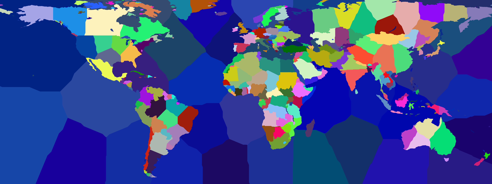
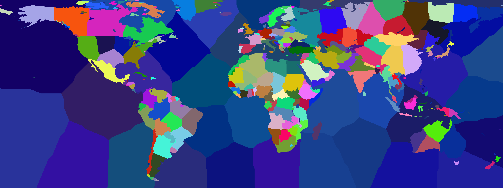
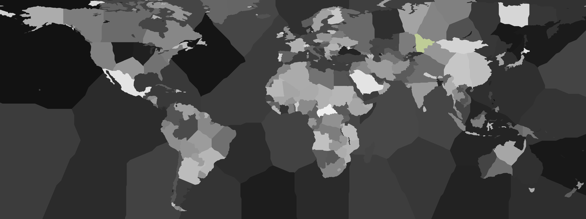

Fragmentation proof:
Kazakhstan has three districts: a western, a central and an eastern one:


To test defragmentation i merged the eastern district into the western one (ran with defragmentation disabled):
 

The fragmentation detection now detects that the seed of the merged district lies within the western portion and the eastern protion is a fragment:


Running with defragmentation enabled splits the fragment up between neighbour districts (it only has one neighbour, the central district):


Code to merge two regions:
```python
color_A = "#2fa16b"
color_B = "#ddf4c5"
idx_A = next((i for i, m in enumerate(metadata) if m.color.lower() == color_A.lower()), None)
idx_B = next((i for i, m in enumerate(metadata) if m.color.lower() == color_B.lower()), None)
if idx_A is not None and idx_B is not None:
    pmap[pmap == idx_A] = idx_B
```
