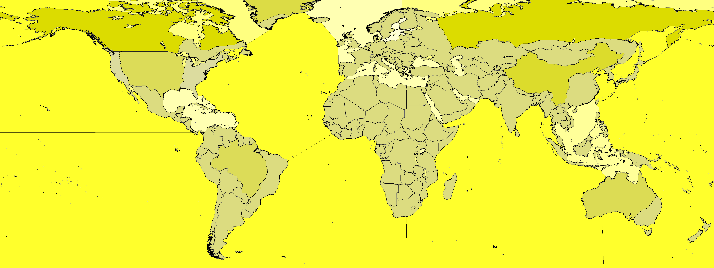

# Open Grand Strategy - Map Tool 
The OpenGS Map Tool is a specialized utility designed to streamline the creation of map data for use in grand strategy games. 
Province and territory maps form the backbone of these games, defining the geographical regions that players interact with.

## Features
- Generate and Export province maps
- Generate and Export province data
- Generate and Export territory maps
- Generate and Export territory data

## Showcase

## How to install
### Option 1 (Windows only):
1. "Releases" section in Github
2. Download and unpack "ogs_maptool.zip"
3. Run the Executable

### Option 2:
1. Clone the repository
2. Download the necessary libraries by running "pip install -r requirements.txt" in your terminal, 
inside the project directory
3. Start project by running "python main.py"

## How to use the tool
### Boundary Image
The first tab defines the bounds that the provinces needs to adhere to.
Typical use would be borders for countries, states or other administrative units.
The boundery borders must be pure black, RGB (0,0,0), everything else will be ignored.
 **Examples:**

### Adapted Boundary Images
1. You should devide up large oceans and countries for a better result, especially if they are a weird shape (like Earth's ocean is).
2. Moreover you most like want to **reduce region density in some areas** (e.g. Siberia's regions should be huge and there should be only a few) and increase it in other very populated. Assigning different densities requires splitting that country.

 **Boundary Image with divided oceans and big countries:**

### Colored Boundary Images
Your boundary image will then be edited, so that the Blue channel of the RGB pixels is `128`:

Now you can use an image editor (like PAINT.NET) to **change the blue channel** to e.g.
- B=255 (high blue -> white) -> **4x more regions**
- B=128 (mid blue -> light yellow) -> **normal**
- B=0 (low blue -> dark yellow) -> **4x fewer regions**

 **After Editing:**

### Land Image
The second tab takes a image that specifies the ocean area of the map,
the color defining the ocean should be close to the RGB color (5,20,18), see example in the folder "example_input".
Everything else is considered land.
 **Examples:**

### Province Image
The third third tab generates the province map, based on the input in tab 1 and 2.
NB! You dont need both inputs, but you need at least one. 
Ex. A map without any ocean, does not need to have a input in tab 1, but then there must be a input in tab2, and visa versa.
Both input images must have the same dimensions/size for a good result.

Use the sliders to adjust the number of provinces on land and ocean.

Province map and the file containing province information(id,rgb,type,coordinates) can be exported after generation.

### Territory Image
The fourt tab generates the territory map, based on the generated provinces.
NB! You need to generate provinces before you can generate territories.

Use the sliders to adjust the number of territories on land and ocean.

Territory map and the file containing province information(id,rgb,type,coordinates) can be exported after generation.
Terriroity json files (One file per territory, defining the belonging provinces) can be exported after generation.

## Contributions
Contributions can come in many forms and all are appreciated:
- Feedback
- Code improvements
- Added functionality

## Delivered and maintained by 

